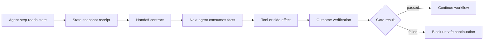

# agent-consistency

Catch false-success bugs in AI agent workflows.

`agent-consistency` is a lightweight Python reliability layer for workflows
where agents read state, hand off context, call tools, and claim real-world
outcomes. It validates state reads, handoff contracts, proof artifacts, and
outcome checks before the workflow continues.

Agent workflows can look successful while acting on stale state, missing
handoff facts, or unverified tool results. `agent-consistency` adds lightweight
contracts and receipts so workflows prove they read the right state, passed the
right context, and verified the real business outcome.

## Install

```bash
python -m pip install agent-consistency
```

From a local checkout:

```bash
python -m venv .venv
source .venv/bin/activate
python -m pip install -U pip
python -m pip install -e ".[dev]"
```

## Tiny Example

```python
from agent_consistency import WorkflowRun

run = WorkflowRun("refund-ord-1", on_violation="record")

with run.step("intake-agent", "read_ticket", step_id="intake") as step:
    order = {"id": "ord_1", "version": "order-v3", "previous_refund_count": 0}
    order_snapshot = step.read_state("order", order, version=order["version"])
    handoff = step.handoff(
        to_agent="refund-agent",
        task="issue refund",
        facts={"order_id": "ord_1", "amount": 42.5, "previous_refund_count": 0},
        evidence={"order.previous_refund_count": order_snapshot.to_dict()},
        required_facts=["order_id", "amount", "previous_refund_count"],
        required_evidence=["order.previous_refund_count"],
    )

with run.step("refund-agent", "issue_refund", step_id="refund") as step:
    step.consume_handoff(handoff)
    provider_result = {"refund_id": "rf_1", "status": "pending"}
    step.write_state("refund", provider_result, version="rf_1", include_value=True)
    step.verify_outcome(
        "refund_settled",
        lambda: provider_result["status"] == "settled",
        failure_reason="refund provider did not confirm settlement",
    )

receipt = run.receipts()[-1]
print(receipt.status)  # failed
print(receipt.issues[0].message)
```

The agent can call the tool, but the workflow does not get to claim completion
until the provider confirms the refund is settled.

## What It Verifies

- **State:** which version of the order, policy, ticket, or record an agent read.
- **Handoff:** whether required facts, assumptions, constraints, and evidence
  reached the next agent.
- **Proof artifacts:** decisions, provider reads, approvals, files, tickets, or
  other evidence attached to a receipt.
- **Outcome verification:** whether the business outcome became true after a
  side-effecting step.
- **Causality:** which downstream step relied on which upstream handoff or
  artifact.

## Why Output Validation Is Not Enough

Output validation can check whether a model response is shaped correctly.
False-success bugs happen after that:

- a policy agent approves from an old policy snapshot
- a support handoff omits previous refund history
- a tool returns `200 OK`, but the provider status is still `pending`
- a customer-visible message says "done" before the business outcome happened

`agent-consistency` focuses on proof before progression. It blocks unsafe
continuation when state, handoff, or outcome verification fails.

## When To Use It

Use it around side-effecting agent workflows:

- refunds
- approvals
- customer support actions
- payment operations
- ticket escalation
- account access changes
- records updates
- workflows that send customer-visible messages

## Where It Fits

`agent-consistency` is complementary to orchestration and observability tools.

| Tool category | How it fits |
| --- | --- |
| LangGraph, CrewAI, AutoGen, custom orchestrators | Wrap steps with receipt gates before moving to the next node. |
| Langfuse, Phoenix, OpenTelemetry tracing | Keep traces; add contract and outcome checks for business correctness. |
| Guardrails and structured output validators | Validate output shape; use this to verify state, handoffs, and side effects. |
| Policy engines | Keep policy decisions; record the policy version and block stale reads. |

It is not a replacement for your agent framework or tracing system. It is a
reliability layer for workflows with side effects.

## Architecture



## Reporting

Summarize a run directory, `summary.json`, or `receipts.jsonl` file:

```bash
agent-consistency report runs/demo-happy-refund
agent-consistency report runs/demo-pending-refund/receipts.jsonl --html report.html
```

The report command prints step status, issues, and outcome checks, and can write
a small static HTML summary.

## Examples

Run the included examples from a local checkout:

```bash
python examples/refund_workflow.py
python examples/approval_gate.py
python examples/tool_outcome_verification.py
python examples/stale_state_prevention.py
python examples/langgraph_style_wrapper.py
```

The `agent_consistency.integrations` module includes a small `run_gated_step`
helper for wrapping LangGraph-style nodes, CrewAI tasks, AutoGen steps, or
custom orchestrator functions.

## Visual Demo

The companion demo is a browser-based **Agent Reliability Control Center** for a
realistic refund workflow:

```bash
git clone https://github.com/karimbaidar/agent-consistency-refund-demo.git
cd agent-consistency-refund-demo
python -m pip install -r requirements-dev.txt
MODEL_PROVIDER=heuristic python -m uvicorn refund_demo.web:app --reload
```

Demo repo:

```text
https://github.com/karimbaidar/agent-consistency-refund-demo
```

The key moment: the refund provider returns `pending`, so the workflow blocks
the customer-facing "refund completed" message.

## Development

```bash
python -m pip install -e ".[dev]"
python -m pytest
ruff check src tests examples
```

Build and check the package:

```bash
python -m build
python -m twine check dist/*
```
