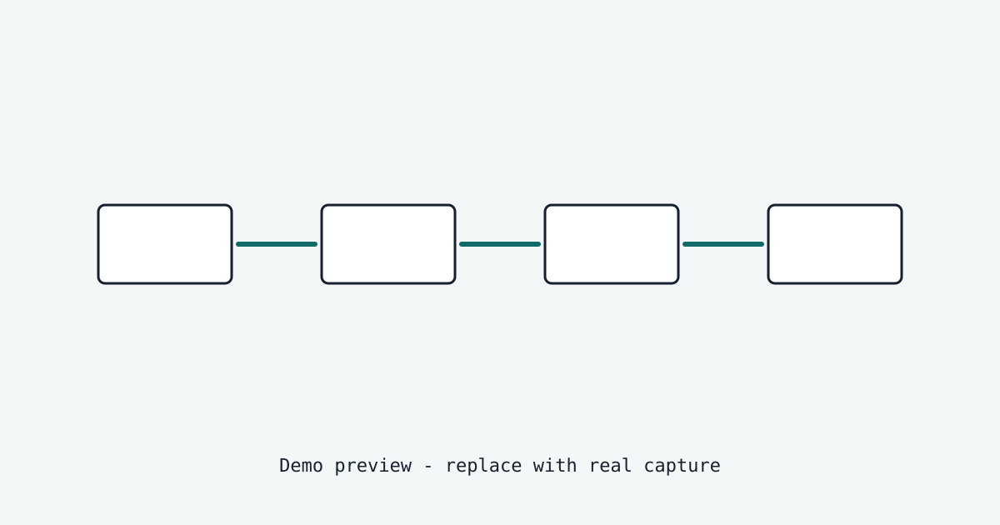

# agent-consistency

[](https://pypi.org/project/agent-consistency/)
[](https://pypi.org/project/agent-consistency/)
[](https://github.com/karimbaidar/agent-consistency/actions/workflows/tests.yml)
[](https://github.com/karimbaidar/agent-consistency/actions/workflows/docs.yml)
[](LICENSE)


Tool success is not business success.

`agent-consistency` is a zero-dependency Python reliability layer for AI agent
workflows. It catches false-success bugs: cases where a tool call returns
success, but the real-world business outcome is still false.

> A refund API returns `200 OK`. The provider status is still `pending`. The
> agent is about to email "your refund is complete." `agent-consistency` blocks
> the message and records why.

Traces show what happened. Evals score what was said. `agent-consistency`
decides whether the workflow was allowed to continue.

[Live demo: watch a false-success bug get blocked](https://karimbaidar.github.io/agent-consistency-refund-demo/) | [Docs source](docs/index.md) | [Quickstart](docs/quickstart.md)

## Architecture Placeholder



## Install

```bash
python -m pip install agent-consistency
```

## The False-Success Bug

A false-success bug happens when an agent reports completion before the real
world agrees.

Common forms:

- **Tool success without outcome success:** a refund call returns `200 OK`, but
  provider status is still `pending`.
- **Stale-state success:** an approval is made from policy v12 while v14 is
  current.
- **Thin-handoff success:** a downstream agent acts without required facts like
  previous refund count.
- **Unsupported-claim success:** a customer-visible message says "done" without
  evidence for the claim.

Output validation checks response shape. Tracing records the path taken.
Neither blocks the next workflow step when the business outcome is still false.

## Add One Outcome Gate

```python
from agent_consistency import WorkflowRun

run = WorkflowRun("refund-ord-1", on_violation="record")

with run.step("refund-agent", "issue_refund", step_id="refund") as step:
    provider_result = {"refund_id": "rf_1", "status": "pending"}
    step.write_state("refund", provider_result, include_value=True)
    step.verify_outcome(
        "refund_settled",
        lambda: provider_result["status"] == "settled",
        failure_reason="refund provider did not confirm settlement",
        details=provider_result,
    )

receipt = run.receipts()[-1]
print(receipt.status)             # failed
print(receipt.issues[0].message)  # outcome 'refund_settled' failed...
```

The tool returned. The receipt says the outcome failed. In the default blocking
mode, the same failed outcome raises before the customer message can run.

## Find Risk Before Blocking

Start in detect mode before you refactor a workflow around gates:

```python
from agent_consistency.integrations import detect_workflow

risk_report = detect_workflow(existing_workflow)
print(risk_report.to_dict())
```

Or run it against stored receipts in CI:

```bash
agent-consistency detect runs/demo-pending-refund/receipts.jsonl
```

`detect` reports missing gates, stale reads, dropped handoff facts, failed
outcomes, and customer-visible actions after unresolved or unverified outcomes.
It exits non-zero on high-severity risk. It cannot know what an agent claimed
unless your workflow declares the outcomes and evidence that matter.

## CLI Receipts

```bash
agent-consistency report runs/demo-pending-refund/receipts.jsonl
agent-consistency detect runs/demo-pending-refund/receipts.jsonl
agent-consistency verify runs/demo-pending-refund/receipts.jsonl
agent-consistency schema
```

Receipts are a flight recorder for AI agents: portable evidence you can inspect
after an incident to see state reads, handoff facts, artifacts, outcomes, and
the blocked reason.

`verify` separates file integrity from run semantics, so a deliberately blocked
pending-refund run can report `Integrity: verified` and `Run status: failed as
expected`.

## Where It Fits

| Category | What it answers | What it misses without agent-consistency |
| --- | --- | --- |
| Guardrails | Is the output shaped correctly? | Whether the business outcome happened. |
| Evals | Was the answer good in a test? | Whether this live workflow may continue. |
| Tracing | What happened? | Whether the next action should be blocked. |
| Orchestration | Which node runs next? | Whether the handoff facts and outcomes are valid. |
| Policy engines | What rule applied? | Whether the agent used a fresh policy snapshot. |

Keep those tools. Add receipts and gates where agents make claims about the
world.

## Docs

- [Quickstart](docs/quickstart.md)
- [Detect mode](docs/detect-mode.md)
- [Receipts and verification](docs/receipts.md)
- [Outcome verification](docs/outcome-verification.md)
- [Production notes](docs/production.md)
- [Compliance framing](docs/compliance.md)
- [False-success bugs](docs/false-success.md)
- [Why agent-consistency](docs/why-agent-consistency.md)

## Bug Zoo

The canonical false-success examples live in `examples/`:

- `minimal_outcome_gate.py`
- `refund_false_success.py`
- `handoff_contract.py`
- `stale_state.py`
- `customer_message_supported_claims.py`

There is also a dependency-free LangGraph-style adapter example in
`examples/langgraph_style_wrapper.py`, plus CrewAI-style and AutoGen-style
examples in `examples/crewai_style_adapter.py` and
`examples/autogen_style_adapter.py`.

## Development

```bash
python -m pip install -e ".[dev]"
python -m pytest
ruff check src tests examples
```

Apache-2.0.
