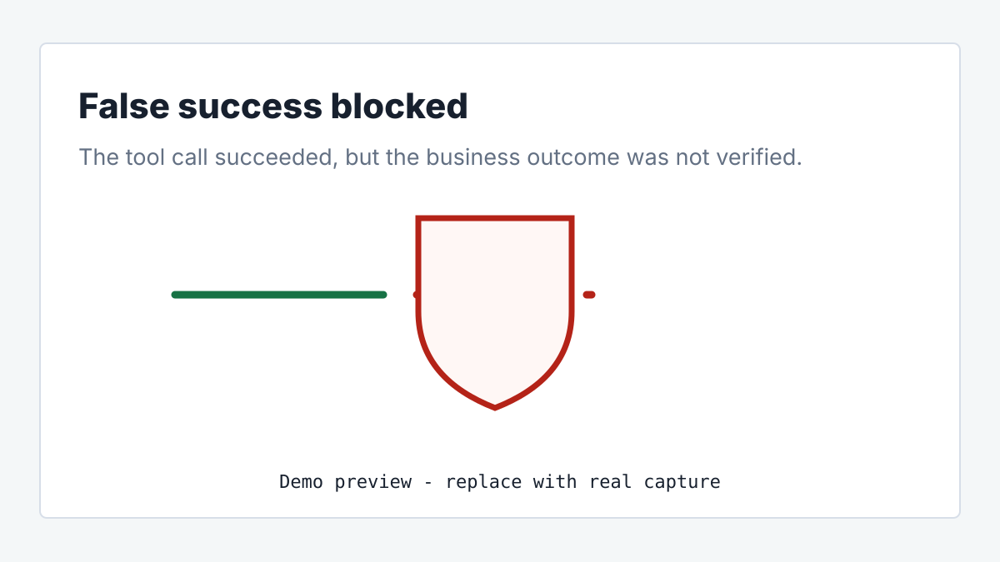
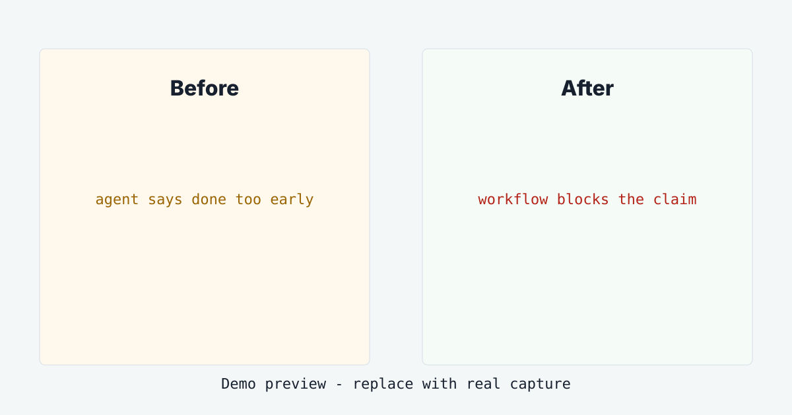
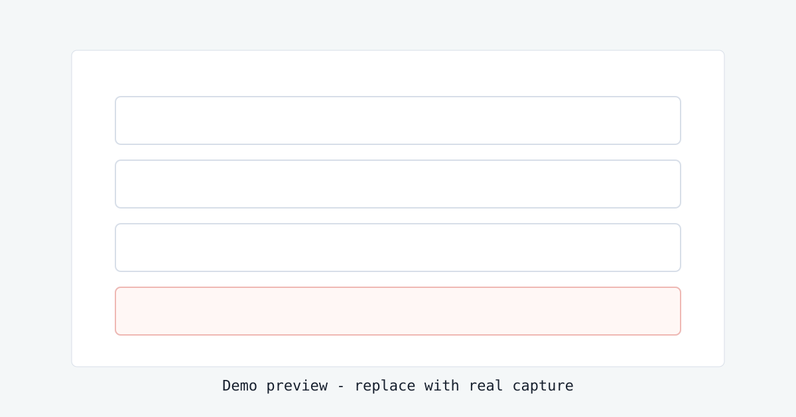

# agent-consistency

[Live demo: watch a false-success bug get blocked](https://karimbaidar.github.io/agent-consistency-refund-demo/)

Evidence receipts for AI agent workflows.

> Your refund agent called the payment API. The API returned 200 OK. The provider status was still `pending`. The agent was about to email "your refund is complete." `agent-consistency` blocks the message and records why.

Traces show what happened. Evals score what was said. `agent-consistency` decides whether the workflow was allowed to continue.

[](https://pypi.org/project/agent-consistency/)
[](https://pypi.org/project/agent-consistency/)
[](https://github.com/karimbaidar/agent-consistency/actions)
[](LICENSE)




## The False-Success Bug

A false-success bug happens when an agent reports completion before the real
world agrees.

Common sub-types:

- **Tool success without outcome success:** a refund call returns 200 OK, but
  provider status is still `pending`.
- **Stale-state success:** an approval is made from policy v12 while v14 is
  current.
- **Thin-handoff success:** a downstream agent acts without required facts like
  previous refund count.
- **Unsupported-claim success:** a customer-visible message says "done" without
  evidence for the claim.

Output validation checks response shape. Tracing records the path taken.
Neither blocks the next workflow step when the business outcome is still false.
That is how a customer gets told money was returned before the provider settled
the refund.

## See It Catch A Lie In 10 Seconds

[Open the live demo](https://karimbaidar.github.io/agent-consistency-refund-demo/)
and run **Pending refund**. The naive flow sends the completed-refund message.
The protected flow blocks it.



```bash
python -m pip install agent-consistency
```

## Minimal Outcome Gate

```python
from agent_consistency import WorkflowRun

run = WorkflowRun("refund-ord-1", on_violation="record")

with run.step("intake-agent", "read_ticket", step_id="intake") as step:
    order = {"id": "ord_1", "previous_refund_count": 0, "version": "order-v3"}
    order_snapshot = step.read_state("order", order, version=order["version"])
    handoff = step.handoff(
        to_agent="refund-agent",
        task="issue refund",
        facts={"order_id": "ord_1", "amount": 42.5, "previous_refund_count": 0},
        evidence={"order.previous_refund_count": order_snapshot.to_dict()},
        required_facts=["order_id", "amount", "previous_refund_count"],
        required_evidence=["order.previous_refund_count"],
    )

with run.step("refund-agent", "issue_refund", step_id="refund") as step:
    step.consume_handoff(handoff)
    provider_result = {"refund_id": "rf_1", "status": "pending"}
    step.write_state("refund", provider_result, include_value=True)
    step.verify_outcome(
        "refund_settled",
        lambda: provider_result["status"] == "settled",
        failure_reason="refund provider did not confirm settlement",
        details=provider_result,
    )

receipt = run.receipts()[-1]
print(receipt.status)             # failed
print(receipt.issues[0].message)  # outcome 'refund_settled' failed...
```

The tool returned. The receipt says the outcome failed. The workflow does not
get to continue into customer messaging.

## CLI Receipts

```bash
agent-consistency report runs/demo-pending-refund/receipts.jsonl
agent-consistency verify runs/demo-pending-refund/receipts.jsonl
agent-consistency schema
```

Receipts are a flight recorder for AI agents: portable evidence you can inspect
after an incident to see state reads, handoff facts, artifacts, outcomes, and
the blocked reason.

`verify` separates file integrity from run semantics, so a deliberately blocked
pending-refund run can report `Integrity: verified` and `Run status: failed as
expected`.



## Why This Is Necessary

Agents are moving from chat into workflows that send emails, issue refunds,
approve changes, update records, and trigger operations. Once an agent takes a
side effect, "the tool call worked" is not enough. The workflow needs evidence
that the real-world condition became true before the next step makes a claim.

Without that gate, a green trace can still end in a customer-visible lie, a
double refund, an approval against stale policy, or an incident where nobody can
reconstruct which facts the agent relied on.

## Where It Fits

| Category | What it answers | What it misses without agent-consistency |
| --- | --- | --- |
| Guardrails | Is the output shaped correctly? | Whether the business outcome happened. |
| Evals | Was the answer good in a test? | Whether this live workflow may continue. |
| Tracing | What happened? | Whether the next action should be blocked. |
| Orchestration | Which node runs next? | Whether the handoff facts and outcomes are valid. |
| Policy engines | What rule applied? | Whether the agent used a fresh policy snapshot. |

Keep those tools. Add receipts and gates where agents make claims about the
world.

## Roadmap

- v0.5: graph export and richer receipt inspection
- v0.6: first stable graph-framework adapter
- v1.0: stable receipt schema

## Docs

- [Receipts and verification](docs/receipts.md)
- [Outcome verification](docs/outcome-verification.md)
- [False-success bugs](docs/false-success.md)
- [Why agent-consistency](docs/why-agent-consistency.md)

## Development

```bash
python -m pip install -e ".[dev]"
python -m pytest
ruff check src tests examples
```

Apache-2.0.
