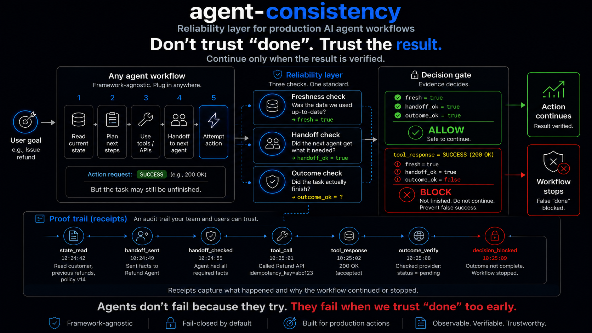

# agent-consistency

[](https://pypi.org/project/agent-consistency/)
[](https://pypi.org/project/agent-consistency/)
[](https://github.com/karimbaidar/agent-consistency/actions/workflows/tests.yml)
[](https://github.com/karimbaidar/agent-consistency/actions/workflows/docs.yml)
[](LICENSE)


Tool success is not business success.

`agent-consistency` is a zero-dependency Python safety interlock for AI agent
workflows that take irreversible or customer-visible actions. It catches
false-success bugs: cases where a tool call returns success, but the confirmed
result is still missing or false.

> A refund API returns `200 OK`. The provider status is still `pending`. The
> agent is about to email "your refund is complete." `agent-consistency` blocks
> the message and records why.

Traces show what happened. Evals score what was said. `agent-consistency`
decides whether the workflow was allowed to continue.

[Live demo: scan workflows for unverified completion risks](https://karimbaidar.github.io/false-success-lab/) | [Quickstart](docs/quickstart.md) | [Benchmark](docs/benchmark.md) | [Production](docs/production.md) | [Compliance](docs/compliance.md)

## Scan Your Repo

Get a pre-integration false-success report card in under 30 seconds:

```bash
agent-consistency scan .
agent-consistency scan . --format markdown
agent-consistency scan . --fail-on high
agent-consistency scan https://github.com/org/repo
```

The scanner is conservative. Low-confidence findings say "Possible risk, needs
review" and should be treated as review prompts, not certain bugs. Use
`--format markdown` for a copyable report suitable for GitHub issues, PR
comments, or social posts.

Benchmark: **raw caught 0/6; agent-consistency caught 6/6** on the deterministic
false-success suite in `benchmark/`. This is a reproducible scenario-suite
result, not a universal reliability guarantee.

## Architecture



The image uses compact labels such as `fresh=true`, `handoff_ok=true`, and
`outcome_ok=false` for readability. Stored receipts use structured JSON fields.
See the [diagram-to-receipt map](docs/diagram-receipt-map.md) and the generated
[pending-refund receipt sample](docs/samples/pending-refund-receipts.jsonl).

## Install

```bash
python -m pip install agent-consistency
```

## The False-Success Bug

A false-success bug happens when an agent reports completion before the source
system confirms the result.

Common forms:

- **Tool success without outcome success:** a refund call returns `200 OK`, but
  provider status is still `pending`.
- **Stale-state success:** an approval is made from policy v12 while v14 is
  current.
- **Thin-handoff success:** a downstream agent acts without required facts like
  previous refund count.
- **Unsupported-claim success:** a customer-visible message says "done" without
  evidence for the claim.

Output validation checks response shape. Tracing records the path taken.
Neither blocks the next workflow step when the confirmed result is still
missing.

## Add One Outcome Gate

```python
from agent_consistency import WorkflowRun

run = WorkflowRun("refund-ord-1", on_violation="record")

with run.step("refund-agent", "issue_refund", step_id="refund") as step:
    provider_result = {"refund_id": "rf_1", "status": "pending"}
    step.write_state("refund", provider_result, include_value=True)
    step.verify_outcome(
        "refund_settled",
        lambda: provider_result["status"] == "settled",
        failure_reason="refund provider did not confirm settlement",
        details=provider_result,
    )

receipt = run.receipts()[-1]
print(receipt.status)             # failed
print(receipt.issues[0].message)  # outcome 'refund_settled' failed...
```

The tool returned. The receipt says the outcome failed. In the default blocking
mode, the same failed outcome raises before the customer message can run.

## Find Risk Before Blocking

Start in detect mode before you refactor a workflow around gates:

```python
from agent_consistency.integrations import detect_workflow

risk_report = detect_workflow(existing_workflow)
print(risk_report.to_dict())
```

Or run it against stored receipts in CI:

```bash
agent-consistency detect runs/demo-pending-refund/receipts.jsonl
```

`detect` reports missing gates, stale reads, dropped handoff facts, failed
outcomes, and customer-visible actions after unresolved or unverified outcomes.
It exits non-zero on high-severity risk. It cannot know what an agent claimed
unless your workflow declares the outcomes and evidence that matter.

## Instrument Any Step

Use `verified_step` when you want to wrap an existing callable without changing
frameworks:

```python
from agent_consistency import RefundSettlementVerifier, WorkflowRun, verified_step

run = WorkflowRun("refund-ord-1")
provider_status = lambda refund_id: {"refund_id": refund_id, "status": "settled"}

@verified_step(
    run,
    "refund-agent",
    "issue_refund",
    criticality="financial",
    idempotency_key="refund:ord_1",
    outcome_verifier=lambda refund: RefundSettlementVerifier(
        refund["refund_id"],
        provider_status,
    ),
)
def issue_refund():
    return {"refund_id": "rf_1"}
```

Use `reliability_gate` as a context manager when you need direct access to the
receipt-backed step. If `agent-consistency[otel]` is installed, the API emits
standard `gen_ai.*` and `agent_consistency.*` span attributes.

## CLI Receipts

```bash
agent-consistency report runs/demo-pending-refund/receipts.jsonl
agent-consistency detect runs/demo-pending-refund/receipts.jsonl
agent-consistency verify runs/demo-pending-refund/receipts.jsonl
agent-consistency schema
```

Receipts are a flight recorder for AI agents: portable evidence you can inspect
after an incident to see state reads, handoff facts, artifacts, outcomes, and
the blocked reason.

`verify` separates file integrity from run semantics, so a deliberately blocked
pending-refund run can report `Integrity: verified` and `Run status: failed as
expected`.

## Where It Fits

| Category | What it answers | What it misses without agent-consistency |
| --- | --- | --- |
| Guardrails | Is the output shaped correctly? | Whether the confirmed result exists. |
| Evals | Was the answer good in a test? | Whether this live workflow may continue. |
| Tracing | What happened? | Whether the next action should be blocked. |
| Orchestration | Which node runs next? | Whether the handoff facts and outcomes are valid. |
| Policy engines | What rule applied? | Whether the agent used a fresh policy snapshot. |

Keep those tools. Add receipts and gates where agents make claims that require
source-system confirmation.

## Docs

- [Quickstart](docs/quickstart.md)
- [Detect mode](docs/detect-mode.md)
- [Benchmark](docs/benchmark.md)
- [Leaderboard](LEADERBOARD.md)
- [Diagram-to-receipt map](docs/diagram-receipt-map.md)
- [Receipts and verification](docs/receipts.md)
- [Outcome verification](docs/outcome-verification.md)
- [Production notes](docs/production.md)
- [Release governance](docs/release-governance.md)
- [Compliance framing](docs/compliance.md)
- [False-success bugs](docs/false-success.md)
- [Why agent-consistency](docs/why-agent-consistency.md)

## Bug Zoo

The canonical false-success examples live in `examples/`:

- `minimal_outcome_gate.py`
- `refund_false_success.py`
- `handoff_contract.py`
- `stale_state.py`
- `customer_message_supported_claims.py`

There is also a dependency-free LangGraph-style adapter example in
`examples/langgraph_style_wrapper.py`, plus CrewAI-style and AutoGen-style
examples in `examples/crewai_style_adapter.py` and
`examples/autogen_style_adapter.py`.

## Microsoft Adapter

There are two Microsoft Agent Framework paths:

- `MicrosoftAgentFrameworkNativeIntegration` for real async Agent Framework
  seams: `Agent.run(...)`, async middleware, function/tool middleware, and
  streaming methods. Install it with `agent-consistency[microsoft]` on Python
  3.10+.
- `MicrosoftAgentFrameworkConsistencyAdapter` as the dependency-light fallback
  for MAF-shaped callables.

```python
from agent_consistency.integrations import MicrosoftAgentFrameworkNativeIntegration

integration = MicrosoftAgentFrameworkNativeIntegration(run_id="refund-maf")
refund_agent = integration.wrap_agent_run(
    maf_refund_agent,
    action="issue_refund",
    criticality="financial",
    outcome_name="refund_settled",
    outcome_check=lambda result: result["status"] == "settled",
)
```

The native integration keeps Microsoft packages out of the base install and
uses the official Agent Framework middleware shape. See
[Microsoft Agent Framework](docs/microsoft-agent-framework.md). The quickest
generic path is still in `examples/instrument_existing_agent/`.

CI also includes a `microsoft-live` job that installs the optional Microsoft
extra and runs a real `agent_framework.Agent` with a deterministic local
`BaseChatClient` provider, so the native wrapper is checked against the actual
package without requiring cloud credentials.

## Development

```bash
python -m pip install -e ".[dev]"
python -m pytest
ruff check src tests examples
```

Apache-2.0.
